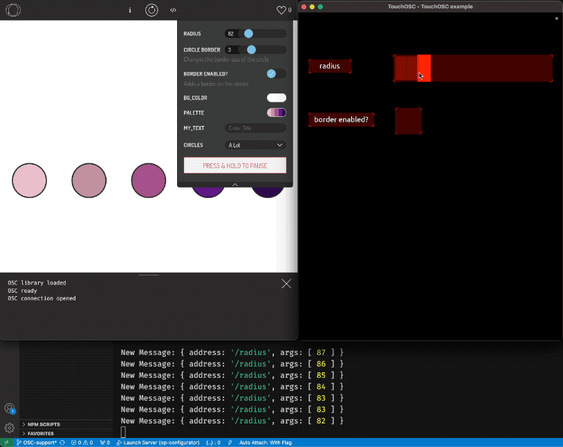

# OP Configurator 3000

This is a helper library that allows generative art project to provide a UI to play with dynamic variables in their projects. Developed particularly [p5.js](https://p5js.org) in mind, this library converts the selected parameters to native UI elements to play with as the sketch runs live. Some applications:

- Sketches that are exhibited to an audience: Audience can play with native UI elements to interact with sketch parameters.
- FXHash params projects: Artists can prepare their FXHash params project using this library.
- or simply experimenting: Artist can turn the variables they want to experiment with to native UI elements.

OP Configurator communicates with the UI elements via postMessage() in browsers. This also allows configurator to be implemented across frames, making it suitable for use with iframes in code editors. Library can also be overridden to use the same mapping to other interfaces, such as physical buttons, knobs, sliders, etc.  

OPC also supports OSC [Open Sound Control](https://en.wikipedia.org/wiki/Open_Sound_Control) protocol and can connect to a websocket server to send/receive OSC data. See [OSC Support](#osc).

## Example

See the full demo on [OpenProcessing](https://openprocessing.org/sketch/1532131).

A simple example below will display a range slider that you can change live while playing your sketch. 

```js
//var radius = 10; //instead of defining a variable, use below
OPC.slider('radius', 10);

function setup() {
    createCanvas(windowWidth, windowHeight);
    background(100);
}

function draw() {
    circle(mouseX, mouseY, radius);
}
```

On OpenProcessing, you can also set these parameter defaults using the URI parameters starting with "sketch_" when you share your sketch. These parameters will be passed on your sketch (with "sketch_" stripped) and OPC library will use these as defaults instead.

Example URL for above:  [https://openprocessing.org/sketch/1532131?sketch_radius=15](https://openprocessing.org/sketch/1532131?sketch_radius=15)


## Available Options

### Slider

Displays a range slider that user can change. 

```js
OPC.slider(variableName, defaultValue, [min], [max], [step]);
//example: OPC.slider('radius', 10, 1, 100, 1);
```

**Defaults**

min: 0

max: 2*defaulValue

step: defaultValue/10 (divides the slider to 10 steps)

### Toggle

Displays a true/false toggle. Also support values 1/0. 

```js
OPC.toggle(variableName, defaultValue);
//example: OPC.toggle('hasFill', false);
```

**Defaults**
defaultValue: true

### Text

Displays a single-line text entry field. Optional placeholder text is displayed if there is no text in the text field.

```javascript
OPC.text(variableName, defaultValue, [placeholder]);
//example: OPC.text('my_text', '', 'Enter Title');
```

### Button

Displays a button. You should use buttonPressed and/or buttonReleased events (see below) to detect user interaction. For simple interactions, using buttonReleased function should suffice.
**buttonText** parameter is used in the button text, and it is also set as the default value for the button variable.

```javascript
OPC.button(variableName, buttonText);
//example: OPC.button('myButton', 'Click Me!');
```

**Defaults**

defaultValue: 'Click Me!'

### Color

Displays a single color selector. Uses the native browser color picker, so the interface may vary. Hex values are recommended. Alpha values are not supported.

```javascript
OPC.color(variableName, defaultValue);
//example: OPC.color('bg_color', '#ffffff');
```

**Defaults**

defaultValue: #333333

### Color Palette

Allows user to switch color palette used, by looping through the options given in 'palleteOptions'. Each pallete is an array of colors (HEX values). If 'defaultValue' is not provided, than first item of the array is used as default. 'defaultValue' may be set to something else other that the ones provided in the array, however, it is not recommended since user will not be able to use it again after changing the pallete.

```javascript
OPC.palette(variableName, palleteOptions, [defaultValue]);
```

**Example**

```javascript
OPC.palette('currentPalette',
    [
        ["#eabfcb", "#c191a1", "#a4508b", "#5f0a87", "#2f004f"],
        ["#c3dfe0", "#bcd979", "#9dad6f", "#7d6d61", "#5e574d"],
        ["#4464ad", "#a4b0f5", "#f58f29", "#7d4600", "#466995"]
    ]);
```

**Defaults**


defaultValue: first option in paletteOptions array

### Select (Dropdown)

Allows users to choose an option from a given set of options using an HTML Select (Dropdown).
Options can be provided either as an array (such as [1,2,3,4,5]) or a key->value object (such as {"A Lot": 5,"Few": 3,"One": 1}). In the latter case, keys are used as a label in Select UI, and the value of the selection is assigned to the variable. 

```javascript
OPC.select(variableName, options, [defaultValue]);
//example with array: OPC.select('circles', [5,4,3,2,1]);
//example with key/value: OPC.select('circles', {"A Lot": 5,"Few": 3,"One": 1});
```

**Defaults**

defaultValue: first value in options array/object.


---

## Passing Arguments as Objects
All OPC components can also be created by passing an object of arguments, such as below. This also allows passing in additional parameters [label, description].
```javascript
OPC.slider({
	name: 'stroke_weight',
	value: 3,
	min: 1,
	max: 10,
	step:1,
	label: 'Circle Border',
	description: 'Changes the border size of the circle'
});
```
Note that, the object values are copied and are **not** referenced; Changing the object arguments at a later time will not effect the OPC component.

## Events

### parameterChanged(variableName, value)

To get an alert everytime a variable changes, you can create "parameterChanged" function in your sketch. For example, if your sketch requires resizing when user changes a variable, you can use this function to get the alert and make necessary changes.

**Example**

```javascript
function parameterChanged(variableName, value) {
    if (variableName === 'canvasSize') {
        resizeCanvas(value, value);
        print('Canvas size updated');
    }
}
```

### buttonPressed([variableName], [value])

To get an alert everytime user presses a button. If you are using multiple buttons, you can differentiate by looking up the variableName. 

**Example**

```javascript
function buttonPressed(variableName, value) {
	if (variableName === 'myButton') {
		print('Button is pressed');
	}
}
```

### buttonReleased([variableName], [value])

To get an alert everytime user releases a pressed a button. If you are using multiple buttons, you can differentiate by looking up the variableName. 

**Example**

```javascript
function buttonPressed(variableName, value) {
	if (variableName === 'myButton') {
		print('Button is released');
	}
}
```


## Utilities

### collapse()

Collapses the OPC configurator panel.
**Example**

```javascript
OPC.collapse();
```

### expand()

Expands the OPC configurator panel.
**Example**

```javascript
OPC.expand();
```

### delete(variableName)

Deletes a variable and removes its UI component from the interface.
**Example**

```javascript
OPC.delete('myVariable');
```


# OSC Support
You can connect OPC to a websocket server to communicate with other devices via OSC protocol. An example websocket server that also opens a UDP port is provided in the oscServer folder. An example OPC control interface (for [TouchOSC](https://hexler.net/touchosc)) is provided in the example folder.




## Example Installation and Setup

### Step 1: Clone the Repository

First, clone this repository to your local machine, and install the necessary dependencies for the server.

```sh
git clone https://github.com/msawired/OPC.git
cd OPC/oscServer
npm install
```

### Step 2: Run the OSC Server

Start the OSC server using the following command:

```sh
node oscServer.js

```

The server will start and listen for incoming OSC messages on the specified port. You can also define the ports and output every message received via:

```sh
node oscServer.js 57120 --verbose
```

### Step 3: Connect via TouchOSC

1. Install and open the [TouchOSC](https://hexler.net/touchosc) app on your device.
2. (Optional) Open the example in the "/example/TouchOSC example.tosc"
2. Go to the "Connections" tab and add a new OSC connection.
3. Set the Host as "127.0.0.1"
4. Set the Send Port to the port number specified in the `oscServer.js` file (default is 57120).
5. Save the connection settings.

2. Open the example layout provided in the `example` folder of the repository.
3. Press play to connect layout to the server.

Your TouchOSC app should now be able to send and receive OSC messages to and from the OSC server.

### Step 4: Connect OPC to the OSC Server

Add the code below to your sketch to connect OPC to your server:
```js
OPC.setOSC('ws://localhost', 8081);
```
Once connected, any changes in the variable values will be sent as an OSC message to TouchOS and vice versa.

### Troubleshooting

- Ensure that your device and the machine running the OSC server are on the same network.
- Verify that the IP address and port number are correctly configured in TouchOSC.
- Check the console output of the OSC server for any error messages.